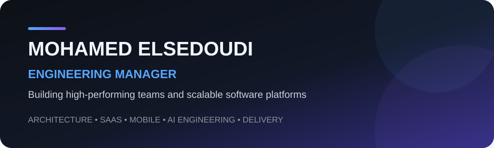
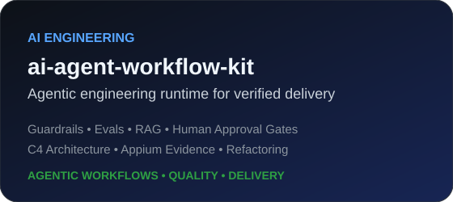
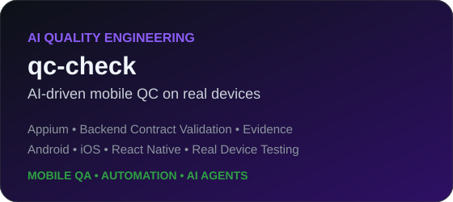
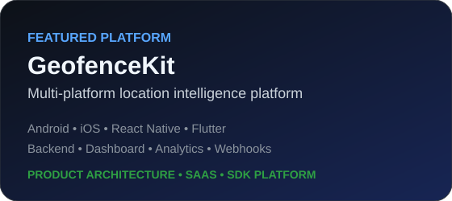
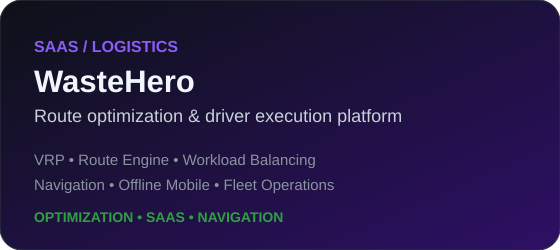
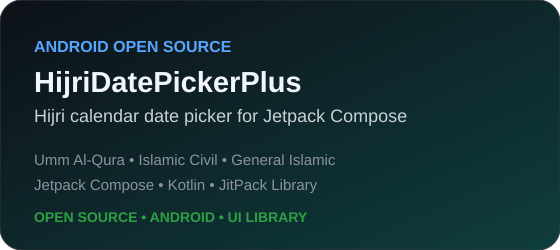

**Engineering Leadership** · **Software Architecture** · **SaaS Platforms** · **Mobile Engineering** · **AI Engineering**

## Executive Profile

Engineering Manager and hands-on software engineer with **12+ years of experience** leading teams, shaping architecture, and delivering production software across mobile, backend, SaaS, and AI-assisted engineering.

My focus is on building strong engineering systems: clear ownership, scalable architecture, predictable delivery, high quality, and teams that can execute independently.

| Leadership | Architecture | Delivery | Product Engineering |
|---|---|---|---|
| Team design, mentoring, hiring, career growth | DDD, Clean Architecture, distributed systems, messaging | Roadmaps, execution, quality, risk | Mobile, backend, SaaS, platform engineering |

---

# 01 — Engineering Leadership

### Leadership Scope

- Engineering team design and ownership models
- Hiring, mentoring, IDPs, career growth, and performance management
- Technical strategy and engineering standards
- Roadmaps, estimation, delivery planning, and risk management
- Cross-functional collaboration across product, design, backend, mobile, and QA
- Engineering quality, security, performance, and developer productivity

### How I Approach Engineering Management

**Business Goals → Product Scope → Architecture → Team Ownership → Delivery → Metrics → Continuous Improvement**

I believe strong engineering management connects **people, architecture, delivery, and product outcomes** rather than treating them as separate concerns.

---

# 02 — Featured Engineering Work

### [ai-agent-workflow-kit](https://github.com/mohamedma872/ai-agent-workflow-kit)

Cross-stack agentic engineering runtime for safer and more verifiable AI-assisted delivery.

**Key areas:**  
`Agentic Workflows` · `Guardrails` · `Evals` · `Hybrid RAG` · `Human Approval Gates` · `C4 Architecture` · `Behavior-Safe Refactoring` · `Appium Evidence`

---

### [qc-check](https://github.com/mohamedma872/qc-check)

AI-driven mobile quality engineering for real-device validation and evidence-backed testing.

**Key areas:**  
`Appium` · `Real Device Testing` · `Backend Contract Validation` · `Automation` · `AI Agents` · `Mobile QA`

---

### [GeofenceKit](https://github.com/mohamedma872/geofencekit-platform)

End-to-end **multi-platform geofencing and location intelligence product** spanning mobile SDKs, backend services, dashboard, analytics, webhooks, and product onboarding.

**Platform scope:**

- Android SDK
- iOS SDK
- React Native SDK
- Flutter SDK
- Backend APIs and event processing
- Device and geofence management
- Campaigns and notifications
- Analytics and webhooks
- Customer/API key management
- Management dashboard
- Product landing website

**Engineering focus:**  
`Product Architecture` · `SDK Design` · `SaaS` · `Backend Systems` · `Web Applications` · `Location Services` · `Offline Events`

[Platform Repository](https://github.com/mohamedma872/geofencekit-platform) · [Live Website](https://geofencekit.com)

---

### WasteHero

Worked on a production SaaS platform for route planning, route optimization, and driver execution in waste collection operations.

**Core areas:**

- Vehicle Routing Problem (VRP)
- Route generation and optimization
- Vehicle assignment
- Workload balancing
- Stop coverage validation
- Scheduling and operational constraints
- Route conflict handling
- Driver navigation application
- Turn-by-turn navigation
- Offline mobile workflows
- Map-based route execution

**Engineering focus:**  
`SaaS` · `VRP` · `Optimization` · `Route Engine` · `Fleet Operations` · `Navigation` · `Offline Mobile`

---

### [HijriDatePickerPlus](https://github.com/mohamedma872/HijriDatePickerPlus)

Open-source Android library providing a flexible **Hijri (Islamic) date picker for Jetpack Compose**, with support for **Umm Al-Qura, Islamic Civil, and General Islamic** calendar systems.

**Key areas:**  
`Kotlin` · `Jetpack Compose` · `Android Library` · `Hijri Calendar` · `Umm Al-Qura` · `JitPack`

---

# 03 — Architecture & Distributed Systems

I design systems around business boundaries, maintainability, reliability, and clear ownership.

### Domain-Driven Design

`Bounded Contexts` · `Entities` · `Value Objects` · `Aggregates` · `Domain Services` · `Repositories` · `Ubiquitous Language`

Focus areas:

- Aligning software boundaries with business domains
- Defining clear ownership between teams and services
- Keeping business rules independent from infrastructure
- Designing APIs and events around domain capabilities
- Reducing shared-model coupling

### Clean Architecture

Typical separation:

| Layer | Responsibility |
|---|---|
| Domain | Business rules, entities, value objects |
| Application | Use cases and orchestration |
| Interface | UI, controllers, API adapters |
| Infrastructure | Databases, queues, external services |

The objective is clear dependency direction, testability, and replaceable infrastructure.

### Messaging & Event-Driven Architecture

Experience with asynchronous and queue-based designs for:

- Background jobs
- Event processing
- Notifications
- Service integrations
- Retryable workflows
- Long-running operations
- Workload smoothing
- Decoupling producers and consumers

**Key design concerns:**  
`Retries` · `Dead-Letter Queues` · `Idempotency` · `Ordering` · `At-Least-Once Delivery` · `Observability` · `Failure Recovery`

### Service & Module Boundaries

`Modular Monoliths` · `Microservices` · `API Contracts` · `Event-Driven Architecture` · `Dependency Management` · `Integration Boundaries`

I prefer boundaries based on **business capability and ownership**, not arbitrary technical splitting.

---

# 04 — Technical Depth

### Mobile Engineering

`Kotlin` · `Java` · `Swift` · `Objective-C` · `React Native` · `Flutter`

`Jetpack Compose` · `SwiftUI` · `Coroutines` · `Flow`

### Backend & APIs

`Python` · `Django` · `PostgreSQL` · `Firebase`

`REST` · `GraphQL` · `Microservices` · `Distributed Systems`

### Engineering Platform

`GitHub` · `GitLab` · `Azure DevOps` · `Jenkins` · `Fastlane` · `SonarQube`

`CI/CD` · `Automated Testing` · `Appium` · `Quality Gates`

### AI Engineering

`AI Coding Agents` · `Agentic Workflows` · `RAG` · `MCP`

`Guardrails` · `Evals` · `Human Approval Gates` · `AI-Assisted Refactoring`

---

# 05 — Engineering Principles

- **Outcomes over output**
- **Clear ownership over coordination overhead**
- **Architecture that supports change**
- **Automation for repetitive work**
- **Evidence-driven quality**
- **Simple systems before complex systems**
- **Continuous improvement over static process**

---

### Engineering Manager · Architect · Builder

**Building teams that build reliable software.**

